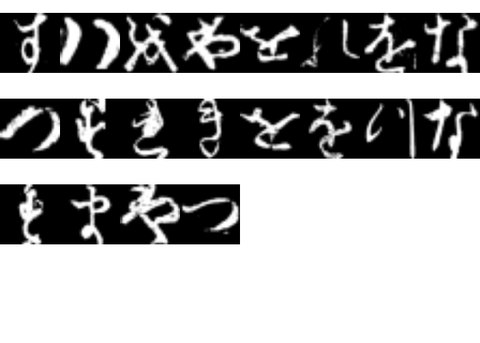

Adapted from:
<https://medium.com/pytorch/please-allow-me-to-introduce-myself-torch-for-r-9ea0f361ea7e>

\#Importing Necessary Package

``` r
#library(devtools)
#install.packages("torch")
#install.packages("torchvision")

library(torch)
library(torchvision)
```

\#Data Preparation

``` r
train_ds <- kmnist_dataset(
  ".",
  download = TRUE,
  train = TRUE,
  transform = transform_to_tensor
)

test_ds <- kmnist_dataset(
  ".",
  download = TRUE,
  train = FALSE,
  transform = transform_to_tensor
)

train_ds[1][[1]]$size()
```

    ## [1]  1 28 28

``` r
train_dl <- dataloader(train_ds, batch_size = 20, shuffle = TRUE, drop_last=FALSE)
test_dl <- dataloader(test_ds, batch_size = 20, shuffle = TRUE, drop_last=FALSE)

train_iter <- train_dl$.iter()
train_iter$.next()
```

    ## $x
    ## torch_tensor
    ## (1,1,.,.) = 
    ##  Columns 1 to 9  0.0000  0.0000  0.0000  0.0000  0.0000  0.0000  0.0000  0.0000  0.0000
    ##   0.0000  0.0000  0.0000  0.0000  0.0000  0.0000  0.0000  0.0000  0.0000
    ##   0.0000  0.0000  0.0000  0.0000  0.0000  0.0000  0.0000  0.0000  0.0000
    ##   0.0000  0.0000  0.0000  0.0000  0.0000  0.0000  0.0000  0.0000  0.0000
    ##   0.0000  0.0000  0.0000  0.0000  0.0000  0.0000  0.0000  0.0000  0.0000
    ##   0.0000  0.0000  0.0000  0.0000  0.0000  0.0000  0.0000  0.0000  0.0000
    ##   0.0000  0.0000  0.0000  0.0000  0.0000  0.0000  0.0000  0.0000  0.0000
    ##   0.0000  0.0000  0.0000  0.0000  0.0000  0.0000  0.0000  0.0000  0.0000
    ##   0.0000  0.0000  0.0000  0.0000  0.0000  0.0000  0.0000  0.0000  0.0000
    ##   0.0000  0.0000  0.0000  0.0000  0.0000  0.0000  0.0000  0.0000  0.0000
    ##   0.0000  0.0000  0.0000  0.0000  0.0000  0.0000  0.0000  0.0000  0.0000
    ##   0.0000  0.0000  0.0000  0.0000  0.0000  0.0000  0.0000  0.0000  0.0000
    ##   0.0000  0.0000  0.0000  0.0000  0.0000  0.0000  0.0000  0.0000  0.0000
    ##   0.0000  0.0000  0.0000  0.0000  0.0000  0.0000  0.0000  0.0000  0.0000
    ##   0.0000  0.0000  0.0000  0.0000  0.0000  0.0000  0.0000  0.0000  0.0000
    ##   0.0000  0.0000  0.0000  0.0000  0.0000  0.0000  0.0000  0.0000  0.0000
    ##   0.0000  0.0000  0.0000  0.0000  0.0000  0.0000  0.0000  0.0000  0.0000
    ##   0.0000  0.0000  0.0000  0.0000  0.0000  0.0000  0.0000  0.0000  0.0000
    ##   0.0000  0.0000  0.0000  0.0039  0.0000  0.0039  0.0078  0.0000  0.0000
    ##   0.0000  0.0000  0.0078  0.5333  0.4157  0.5490  0.6902  0.0588  0.0196
    ##   0.0000  0.0000  0.1490  0.9451  0.9608  0.9333  0.4941  0.0196  0.0000
    ##   0.0000  0.0000  0.0549  0.8000  1.0000  1.0000  0.5765  0.0118  0.0000
    ##   0.0000  0.0000  0.0000  0.1765  0.9098  1.0000  0.9804  0.6824  0.3451
    ##   0.0000  0.0000  0.0000  0.0039  0.4314  0.9725  1.0000  1.0000  1.0000
    ##   0.0000  0.0000  0.0000  0.0000  0.0078  0.2824  0.9333  1.0000  1.0000
    ##   0.0000  0.0000  0.0000  0.0000  0.0000  0.0000  0.1569  0.7294  1.0000
    ##   0.0000  0.0000  0.0000  0.0000  0.0000  0.0000  0.0000  0.0824  0.6078
    ##   0.0000  0.0000  0.0000  0.0000  0.0000  0.0000  0.0000  0.0000  0.0000
    ## 
    ## ... [the output was truncated (use n=-1 to disable)]
    ## [ CPUFloatType{20,1,28,28} ]
    ## 
    ## $y
    ## torch_tensor
    ##   2
    ##   6
    ##  10
    ##   1
    ##   2
    ##   5
    ##   5
    ##   2
    ##   1
    ##   4
    ##   1
    ##   8
    ##   6
    ##   9
    ##  10
    ##   2
    ##   1
    ##   4
    ##   5
    ##   8
    ## [ CPULongType{20} ]

``` r
#print out the 1st batch of characters
par(mfrow = c(4,8), mar = rep(0, 4))
images <- train_dl$.iter()$.next()[[1]][1:32, 1, , ] 
images %>%
  purrr::array_tree(1) %>%
  purrr::map(as.raster) %>%
  purrr::iwalk(~{plot(.x)})
```

<!-- -->

\#Neural Net Definition

``` r
net <- nn_module(
  
  "KMNIST-CNN",
  
  initialize = function() {
    # in_channels, out_channels, kernel_size, stride = 1, padding = 0
    self$conv1 <- nn_conv2d(1, 8, 5)
    self$conv2 <- nn_conv2d(8, 16, 5)
    self$dropout1 <- nn_dropout2d(0.25)
    self$fc1 <- nn_linear(16*10*10, 256)
    self$fc2 <- nn_linear(256, 10)
  },
  
  forward = function(x) {
    x %>% 
      self$conv1() %>%
       nnf_relu() %>%
      self$conv2() %>%
       nnf_relu() %>%
      nnf_max_pool2d(2) %>%
      self$dropout1() %>%
      torch_flatten(start_dim = 2) %>%
      self$fc1() %>%
       nnf_relu() %>%
      self$fc2() %>%
       nnf_sigmoid()
  }
)

model<- net()
```

\#Tensor size calculator and pre-testing

``` r
#dimension of input tensor
x <- torch_randn(c(1, 1, 28, 28))

conv1 <- nn_conv2d(1, 32, 5)
conv1(x)$size()
```

    ## [1]  1 32 24 24

``` r
conv2 <- nn_conv2d(32, 64, 5)
conv2(conv1(x))$size()
```

    ## [1]  1 64 20 20

``` r
maxpool1 <- nn_max_pool2d(2)
maxpool1(conv2(conv1(x)))$size()
```

    ## [1]  1 64 10 10

``` r
torch_flatten(maxpool1(conv2(conv1(x))), start_dim = 2)$size()
```

    ## [1]    1 6400

``` r
linear1 <- nn_linear(64*10*10, 256)
linear1(torch_flatten(maxpool1(conv2(conv1(x))), start_dim = 2))$size()
```

    ## [1]   1 256

``` r
linear2 <- nn_linear(256, 10)
linear2(linear1(torch_flatten(maxpool1(conv2(conv1(x))), start_dim = 2)))$size()
```

    ## [1]  1 10

\#Network Training

\#Cross Entrpy <https://www.desmos.com/calculator/zytm2sf56e> ,
<https://towardsdatascience.com/cross-entropy-for-dummies-5189303c7735>

``` r
model <- net()
model$to(device = "cuda")

optimizer <- optim_adam(model$parameters)

for (epoch in 1:5) {
  l <- c()
  i <- 1
  for (b in enumerate(train_dl)) {
    # make sure each batch's gradient updates are calculated from a fresh start
    optimizer$zero_grad()
    # get model predictions
    output <- model(b[[1]]$to(device = "cuda"))
    # calculate loss
    loss <- nnf_cross_entropy(output, b[[2]]$to(device = "cuda"))
    # calculate gradient
    loss$backward()
    # apply weight updates
    optimizer$step()
    # track losses
    l <- c(l, loss$item())
    i <- i + 1
    if(i %% 100 == 0){cat(paste("Loss at",mean(l),"-- i at:",i,"\n"))}
  }
  cat(sprintf("Loss at epoch %d: %3f\n", epoch, mean(l)))
}
```

    ## Loss at 1.92495429275012 -- i at: 100 
    ## Loss at 1.83919065022588 -- i at: 200 
    ## Loss at 1.80157991795237 -- i at: 300 
    ## Loss at 1.76904915866995 -- i at: 400 
    ## Loss at 1.74835771835878 -- i at: 500 
    ## Loss at 1.73071604618843 -- i at: 600 
    ## Loss at 1.71530096878821 -- i at: 700 
    ## Loss at 1.70276886635042 -- i at: 800 
    ## Loss at 1.69066173216127 -- i at: 900 
    ## Loss at 1.68057572423994 -- i at: 1000 
    ## Loss at 1.67213823504617 -- i at: 1100 
    ## Loss at 1.66458908720152 -- i at: 1200 
    ## Loss at 1.65740864675168 -- i at: 1300 
    ## Loss at 1.65097428373646 -- i at: 1400 
    ## Loss at 1.64447319618935 -- i at: 1500 
    ## Loss at 1.63880335621121 -- i at: 1600 
    ## Loss at 1.63381574152497 -- i at: 1700 
    ## Loss at 1.62947650204903 -- i at: 1800 
    ## Loss at 1.62515968708944 -- i at: 1900 
    ## Loss at 1.62106202583781 -- i at: 2000 
    ## Loss at 1.61717898139163 -- i at: 2100 
    ## Loss at 1.61398575017538 -- i at: 2200 
    ## Loss at 1.610608877333 -- i at: 2300 
    ## Loss at 1.60744536767755 -- i at: 2400 
    ## Loss at 1.6047621158277 -- i at: 2500 
    ## Loss at 1.60182540780904 -- i at: 2600 
    ## Loss at 1.5994120641919 -- i at: 2700 
    ## Loss at 1.59736084120322 -- i at: 2800 
    ## Loss at 1.59524489419548 -- i at: 2900 
    ## Loss at 1.59339506151518 -- i at: 3000 
    ## Loss at epoch 1: 1.593362
    ## Loss at 1.52567877552726 -- i at: 100 
    ## Loss at 1.526355165333 -- i at: 200 
    ## Loss at 1.52448227094567 -- i at: 300 
    ## Loss at 1.52385984208052 -- i at: 400 
    ## Loss at 1.52310714525785 -- i at: 500 
    ## Loss at 1.52218242380177 -- i at: 600 
    ## Loss at 1.52327733950554 -- i at: 700 
    ## Loss at 1.52460061146112 -- i at: 800 
    ## Loss at 1.52475931368627 -- i at: 900 
    ## Loss at 1.52535045767451 -- i at: 1000 
    ## Loss at 1.52516162514795 -- i at: 1100 
    ## Loss at 1.52505910426403 -- i at: 1200 
    ## Loss at 1.52487624884569 -- i at: 1300 
    ## Loss at 1.52435701765956 -- i at: 1400 
    ## Loss at 1.52394584841216 -- i at: 1500 
    ## Loss at 1.52389923977509 -- i at: 1600 
    ## Loss at 1.52336671985269 -- i at: 1700 
    ## Loss at 1.52305520024811 -- i at: 1800 
    ## Loss at 1.52278614778654 -- i at: 1900 
    ## Loss at 1.52243684428283 -- i at: 2000 
    ## Loss at 1.52206633703205 -- i at: 2100 
    ## Loss at 1.52171442599771 -- i at: 2200 
    ## Loss at 1.52153088228243 -- i at: 2300 
    ## Loss at 1.52130210494041 -- i at: 2400 
    ## Loss at 1.52129953028727 -- i at: 2500 
    ## Loss at 1.52058009268367 -- i at: 2600 
    ## Loss at 1.52038017393439 -- i at: 2700 
    ## Loss at 1.5202326936439 -- i at: 2800 
    ## Loss at 1.51997505467116 -- i at: 2900 
    ## Loss at 1.51951671775558 -- i at: 3000 
    ## Loss at epoch 2: 1.519507
    ## Loss at 1.51440162249286 -- i at: 100 
    ## Loss at 1.51308719357054 -- i at: 200 
    ## Loss at 1.51166137484802 -- i at: 300 
    ## Loss at 1.51278421872839 -- i at: 400 
    ## Loss at 1.51175478536763 -- i at: 500 
    ## Loss at 1.51067086810461 -- i at: 600 
    ## Loss at 1.5108278017699 -- i at: 700 
    ## Loss at 1.5106618204463 -- i at: 800 
    ## Loss at 1.50973989568377 -- i at: 900 
    ## Loss at 1.50989342702402 -- i at: 1000 
    ## Loss at 1.51035633002551 -- i at: 1100 
    ## Loss at 1.51016523263373 -- i at: 1200 
    ## Loss at 1.50958744840864 -- i at: 1300 
    ## Loss at 1.50937646895839 -- i at: 1400 
    ## Loss at 1.50894761204799 -- i at: 1500 
    ## Loss at 1.5087577865003 -- i at: 1600 
    ## Loss at 1.5088797934691 -- i at: 1700 
    ## Loss at 1.508667118222 -- i at: 1800 
    ## Loss at 1.50827129261314 -- i at: 1900 
    ## Loss at 1.50837626285467 -- i at: 2000 
    ## Loss at 1.50842589085985 -- i at: 2100 
    ## Loss at 1.50834322685868 -- i at: 2200 
    ## Loss at 1.50803219846872 -- i at: 2300 
    ## Loss at 1.50791008937553 -- i at: 2400 
    ## Loss at 1.50749858091621 -- i at: 2500 
    ## Loss at 1.50740816644542 -- i at: 2600 
    ## Loss at 1.50717712751624 -- i at: 2700 
    ## Loss at 1.50711254095682 -- i at: 2800 
    ## Loss at 1.50700261478549 -- i at: 2900 
    ## Loss at 1.50684369162903 -- i at: 3000 
    ## Loss at epoch 3: 1.506841
    ## Loss at 1.49064006227435 -- i at: 100 
    ## Loss at 1.49549276984517 -- i at: 200 
    ## Loss at 1.49631962010693 -- i at: 300 
    ## Loss at 1.4984310477001 -- i at: 400 
    ## Loss at 1.49924270232359 -- i at: 500 
    ## Loss at 1.49997940147062 -- i at: 600 
    ## Loss at 1.4998141375393 -- i at: 700 
    ## Loss at 1.50124923532388 -- i at: 800 
    ## Loss at 1.50145382610656 -- i at: 900 
    ## Loss at 1.50204081554432 -- i at: 1000 
    ## Loss at 1.50194072235271 -- i at: 1100 
    ## Loss at 1.5014739667902 -- i at: 1200 
    ## Loss at 1.50126151620103 -- i at: 1300 
    ## Loss at 1.50101972265359 -- i at: 1400 
    ## Loss at 1.50136657147665 -- i at: 1500 
    ## Loss at 1.50146529285366 -- i at: 1600 
    ## Loss at 1.50106035561475 -- i at: 1700 
    ## Loss at 1.50057977447913 -- i at: 1800 
    ## Loss at 1.50044296502188 -- i at: 1900 
    ## Loss at 1.50035994079126 -- i at: 2000 
    ## Loss at 1.50012200125176 -- i at: 2100 
    ## Loss at 1.50001760193737 -- i at: 2200 
    ## Loss at 1.49987226509436 -- i at: 2300 
    ## Loss at 1.49997230925725 -- i at: 2400 
    ## Loss at 1.50007969243567 -- i at: 2500 
    ## Loss at 1.50019588998851 -- i at: 2600 
    ## Loss at 1.50032670103033 -- i at: 2700 
    ## Loss at 1.50022152859469 -- i at: 2800 
    ## Loss at 1.50033876590788 -- i at: 2900 
    ## Loss at 1.50020602612783 -- i at: 3000 
    ## Loss at epoch 4: 1.500196
    ## Loss at 1.50008949486896 -- i at: 100 
    ## Loss at 1.50202030991789 -- i at: 200 
    ## Loss at 1.50151193739977 -- i at: 300 
    ## Loss at 1.49912640773563 -- i at: 400 
    ## Loss at 1.49856327721972 -- i at: 500 
    ## Loss at 1.49751815891425 -- i at: 600 
    ## Loss at 1.49660979456485 -- i at: 700 
    ## Loss at 1.49738812640552 -- i at: 800 
    ## Loss at 1.49694104786046 -- i at: 900 
    ## Loss at 1.49732425095918 -- i at: 1000 
    ## Loss at 1.49696231593426 -- i at: 1100 
    ## Loss at 1.49654966070813 -- i at: 1200 
    ## Loss at 1.49613930731209 -- i at: 1300 
    ## Loss at 1.49613346825164 -- i at: 1400 
    ## Loss at 1.49607160681482 -- i at: 1500 
    ## Loss at 1.4956782586579 -- i at: 1600 
    ## Loss at 1.49546510545979 -- i at: 1700 
    ## Loss at 1.49526698765588 -- i at: 1800 
    ## Loss at 1.49533255932644 -- i at: 1900 
    ## Loss at 1.49523836949755 -- i at: 2000 
    ## Loss at 1.49510515747098 -- i at: 2100 
    ## Loss at 1.49497174717937 -- i at: 2200 
    ## Loss at 1.49530893297183 -- i at: 2300 
    ## Loss at 1.4955702184786 -- i at: 2400 
    ## Loss at 1.4955390568684 -- i at: 2500 
    ## Loss at 1.49558786058848 -- i at: 2600 
    ## Loss at 1.49564377097299 -- i at: 2700 
    ## Loss at 1.49554410611957 -- i at: 2800 
    ## Loss at 1.49538344200334 -- i at: 2900 
    ## Loss at 1.49523432288976 -- i at: 3000 
    ## Loss at epoch 5: 1.495228

``` r
model$eval()
```

\#Model Evaluation

``` r
test_losses <- c()
total <- 0
correct <- 0
count <- 0
for (b in enumerate(test_dl)) {
  # get model predictions
  output <- model(b[[1]]$to(device = "cuda"))
  labels <- b[[2]]$to(device = "cuda")
  # calculate loss
  loss <- nnf_cross_entropy(output, labels)
  test_losses <- c(test_losses, loss$item())
  # torch_max returns a list, with position 1 containing the values 
  # and position 2 containing the respective indices
  predicted <- torch_max(output$data(), dim = 2)[[2]]
  # add number of correct classifications in this batch to the aggregate
  correct <- correct + as.numeric((predicted == labels)$sum()$to(device = "cpu"))
  count <- count + 1
  if(count %% 100 == 0){cat(paste("Correct",correct,";count",count*20,"\n"))}
}
```

    ## Correct 1833 ;count 2000 
    ## Correct 3646 ;count 4000 
    ## Correct 5450 ;count 6000 
    ## Correct 7272 ;count 8000 
    ## Correct 9075 ;count 10000

``` r
mean(test_losses)
```

    ## [1] 1.544083

``` r
correct/(count*20)
```

    ## [1] 0.9075
